# 臻优学-幼儿园管理系统

## 一、功能介绍：

### 智慧教育，触手可及

臻优学幼儿园管理系统集成了智能考勤、财务报表、教学计划、家校互动等多个关键模块，全面实现幼儿园日常管理的自动化和智能化。家长可以通过便捷的访问端口，实时掌握孩子在校的出勤情况、健康状况、学习进度和活动参与度，有效增强家校沟通与合作。系统提供详尽透明的财务报表和高效的缴费管理功能，确保幼儿园的财务管理流程清晰、规范。

系统特别关注孩子的健康与成长，内置保健档案、晨午检记录和智能评测工具，为幼儿园提供全方位的健康监护支持。同时，教学计划和作业管理功能帮助教师更好地规划与执行教学活动，显著提升教学质量。

臻优学幼儿园管理系统通过先进技术赋能教育，携手家长与教师，共同促进孩子的全面发展。系统采用了 SpringBoot、MyBatis、Vue.js 和 ElementUI 等主流技术栈，经过严格测试与优化，确保系统的稳定性与高性能。代码遵循阿里巴巴Java开发规范，并且模块之间相互独立，调用通过公共类完成，便于后续将系统演化为微服务架构。每个功能模块都附有详细的注释说明，便于二次开发和个性化定制。

## 二、主要功能

### PC端功能

#### 校区端功能

- **首页和配置**: 消息通知中心、待审批统计、入口列表和Banner、首页广告位
- **待办事项**: 学生请假、交费审批、员工请假、意外事故处理
- **智能考勤**: 学生考勤、员工考勤
- **教务管理**: 请假管理、校园通讯录、作业管理、微课件、公共教育、教学计划、园长信箱、家校互动
- **保健工作**: 日常检查、喂药登记、体格锻炼、复课审批、喂药审批
- **财务管理**: 班主任数据、财务报表（班级分级统计、学生欠费数据等）、线下缴费、收费设置、交易查询
- **健康管理**: 健康档案、特殊关注人员管理、高危体弱管理、疾病记录、传染病记录、疫苗登记、意外事故登记
- **校区管理**: 招生管理、考勤时间配置、年级班级配置、学期管理、课程配置、员工档案管理、学生离返校管理、考勤记录、操作记录
- **角色管理**: 教师、园长、保健医生、助理四个岗位，不同岗位对应不同数据和操作权限，符合实际工作流程

#### 集团端功能

- **基础配置**: 校区管理、权限管理、员工档案、岗位配置、登录管理
- **财务管理**: 财务汇总统计、收费统计、收款明细、减免明细、退款明细

#### 平台端功能

- **平台操作**: 集团管理、进入集团、操作记录

### 用户端功能

- **首页**: 缴费通知、孩子出勤、知识拓展、园长信箱、校园通知、教学计划、班级活动、班级通讯录、待办事项
- **申请**: 请假、复课、喂药审批及查看
- **健康**: 保健档案、体检记录、晨午检记录、学生喂药、智能评测、保健知识推荐
- **我的**: 个人信息、缴费订单、密码修改、消息通知、班级信息

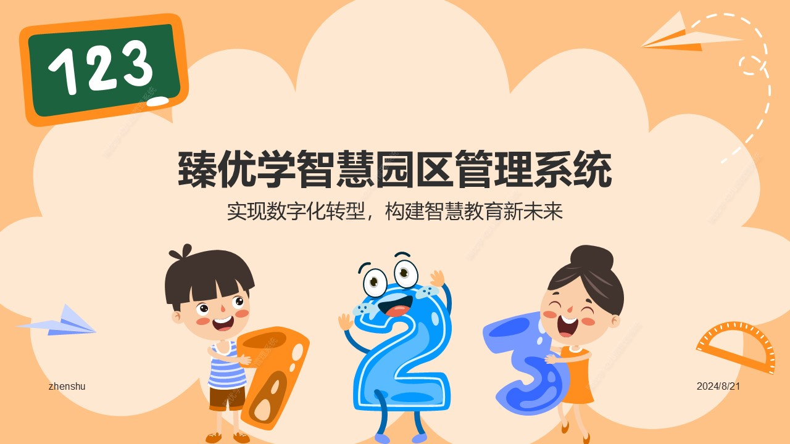
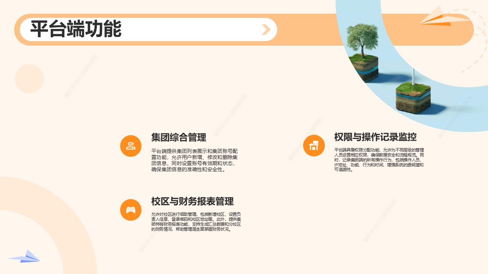
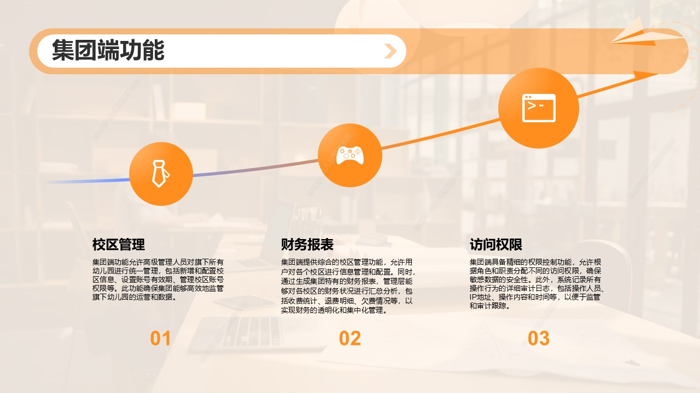

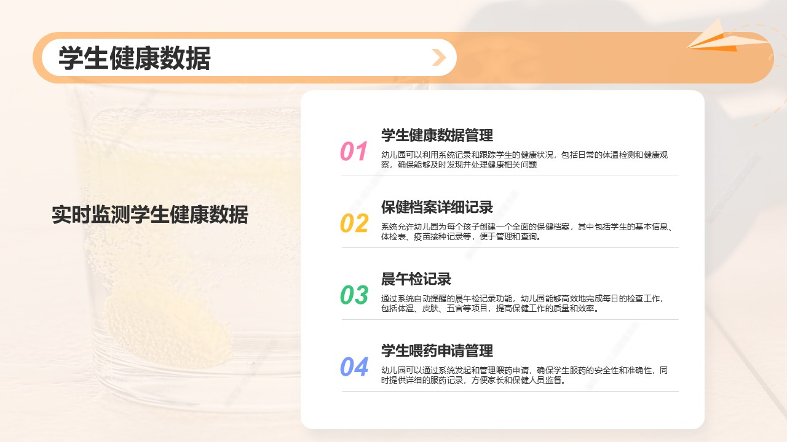
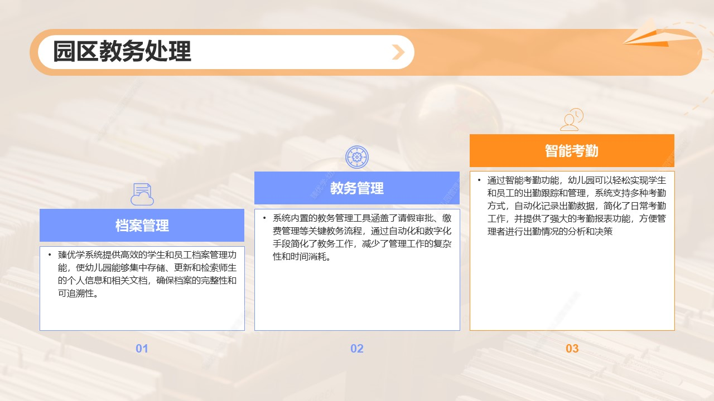
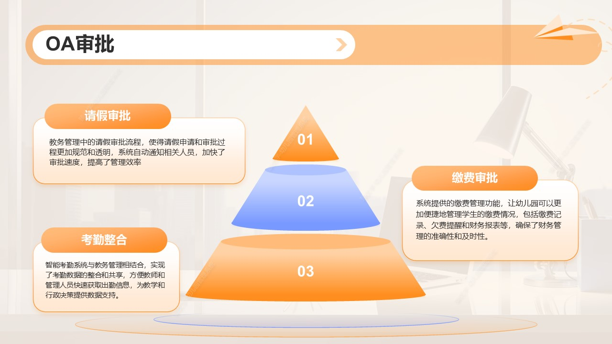
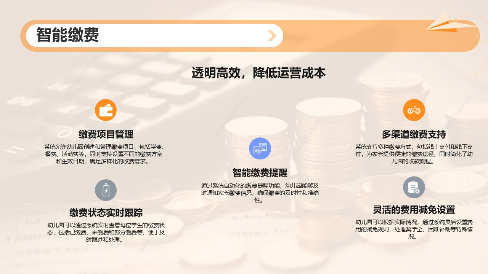
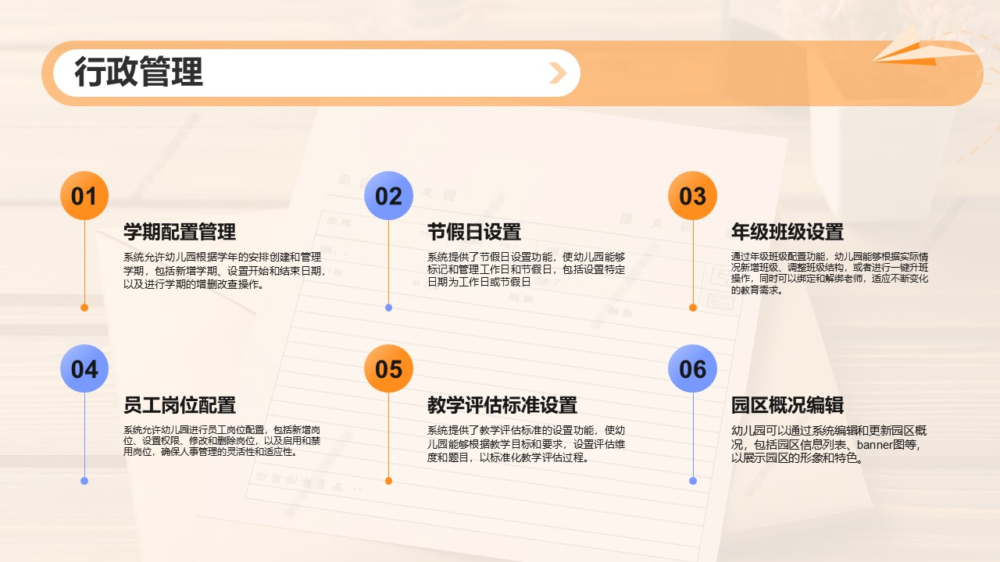
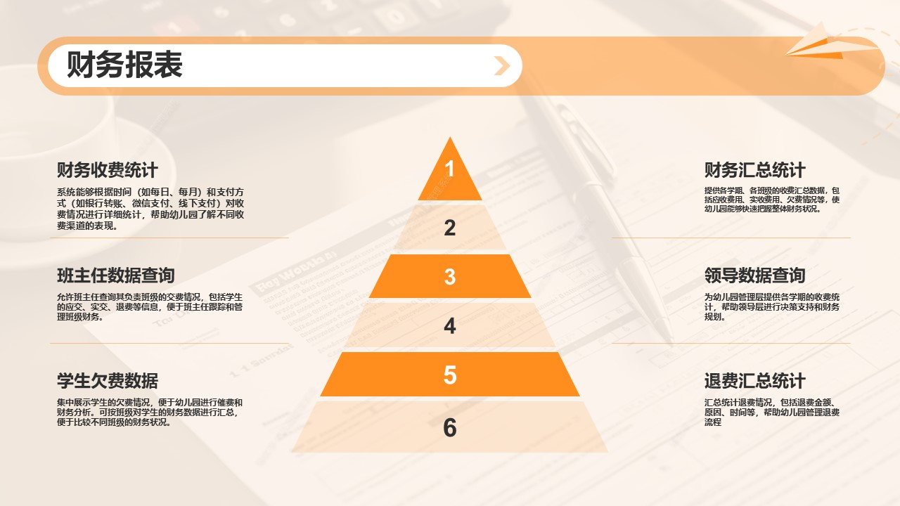
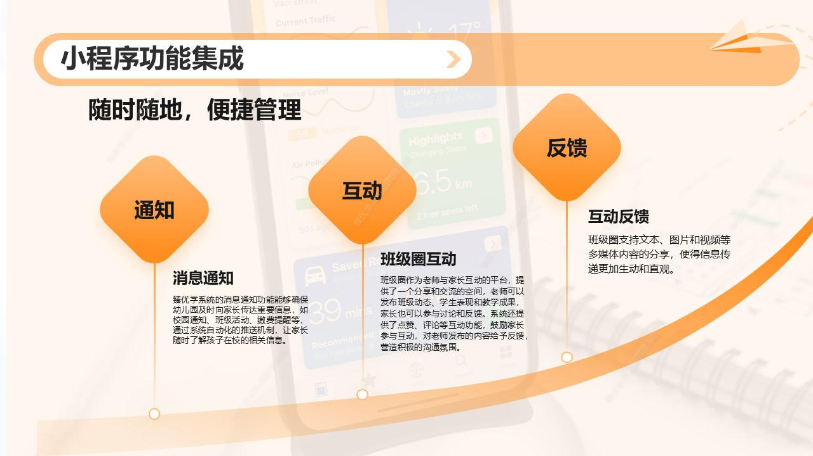
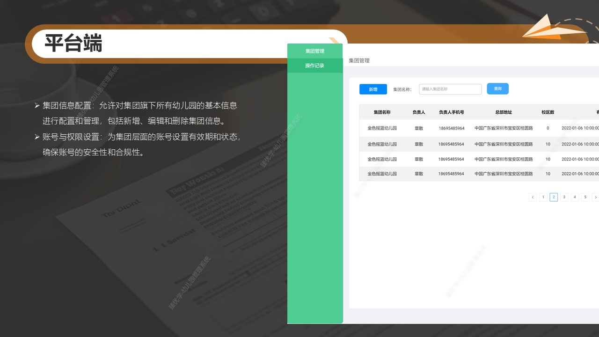
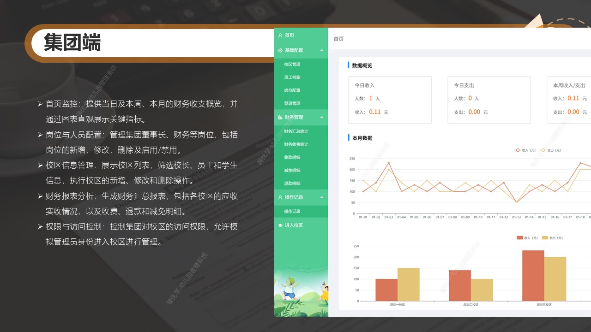
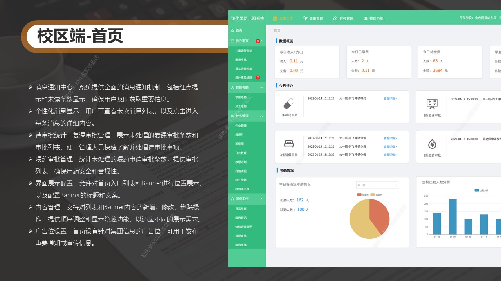
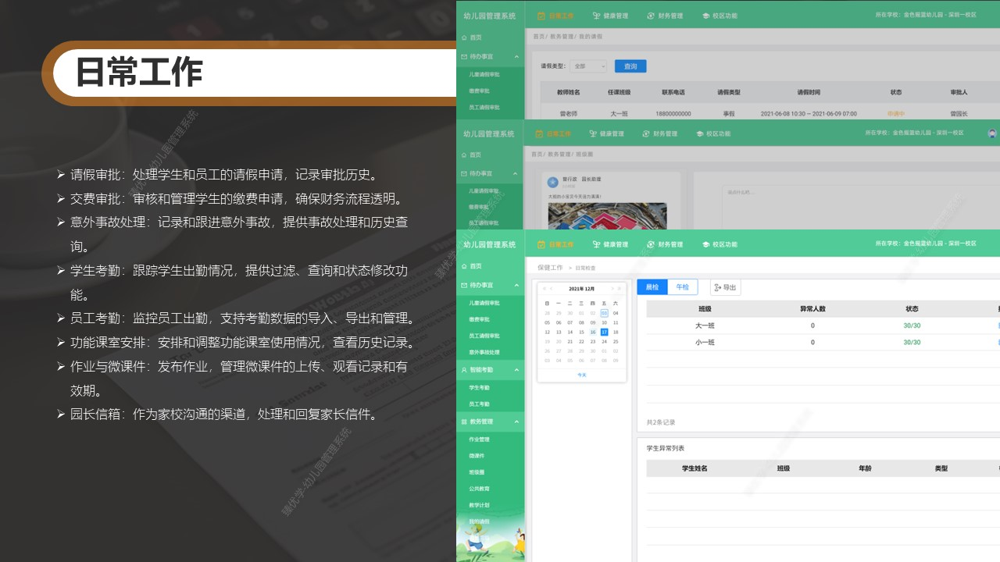
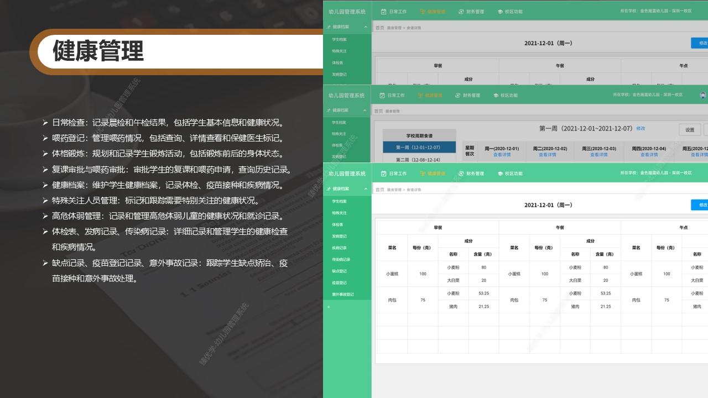
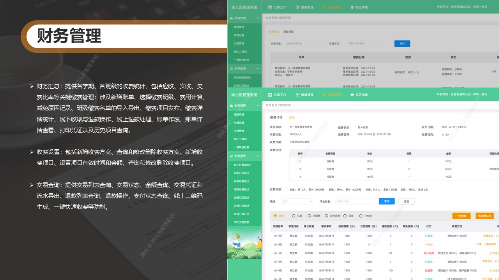
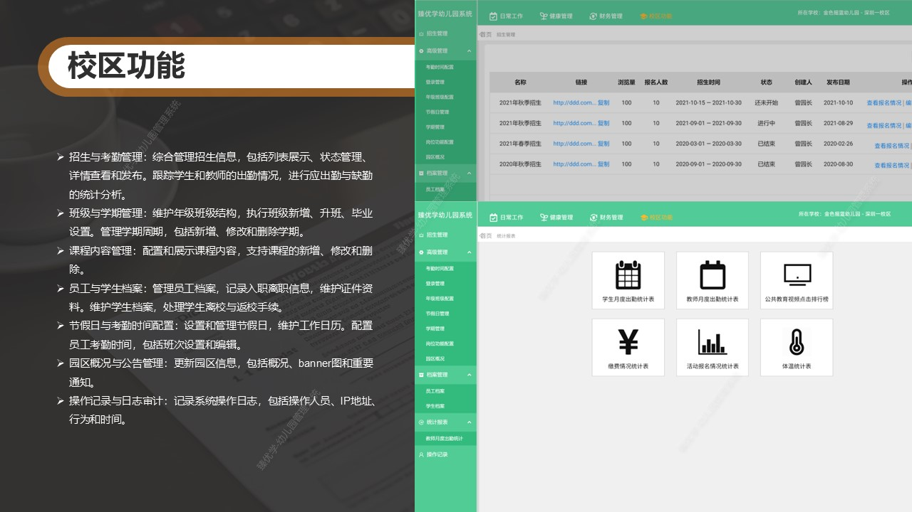
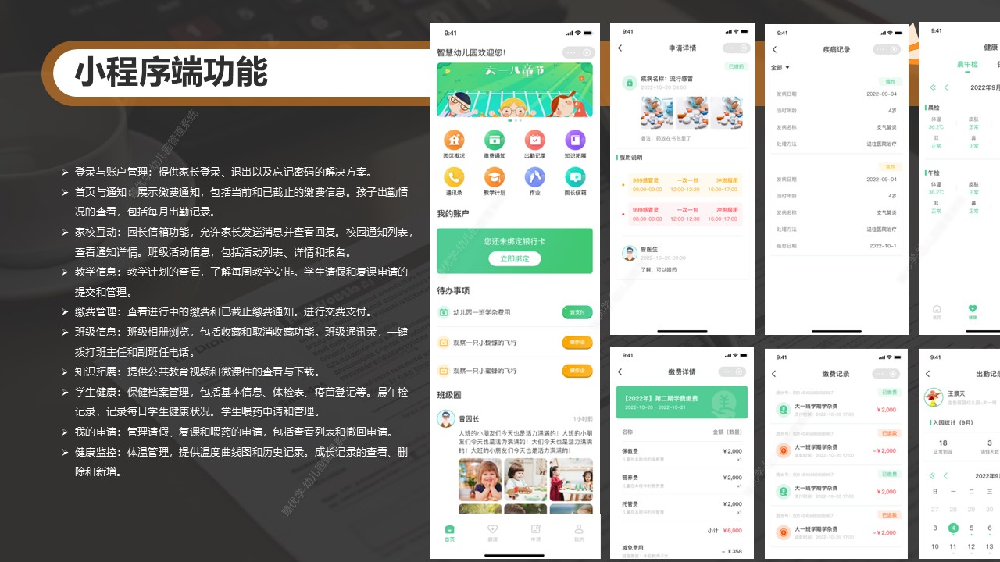

### 四、联系我们

可添加微信好友，获取完整源代码和项目体验地址

