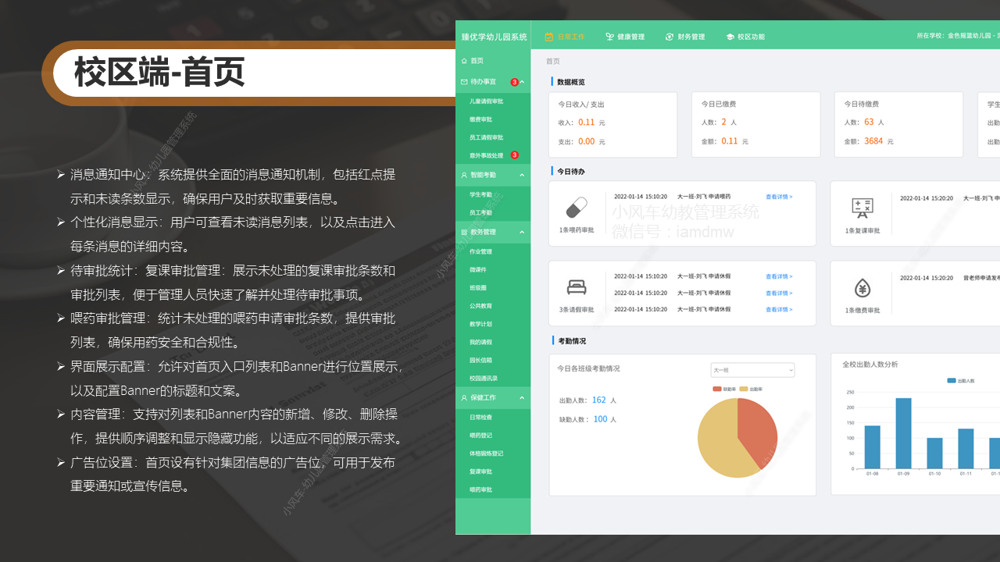
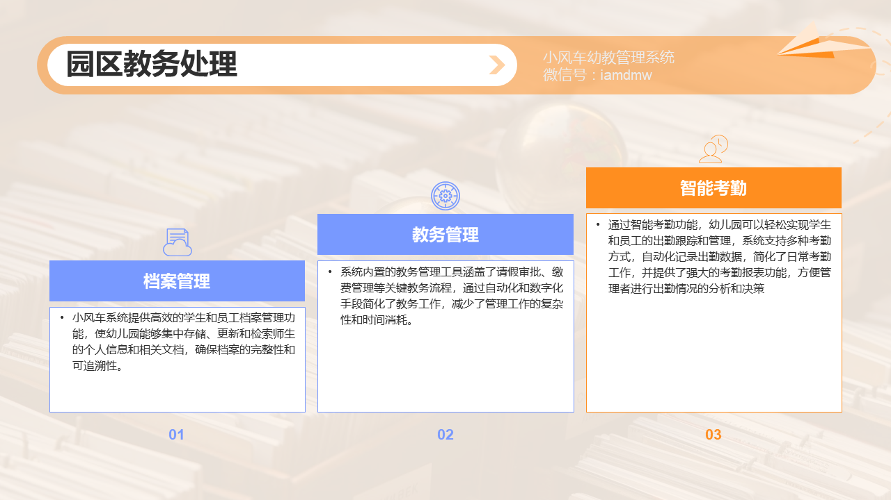

# 小风车智慧幼教 · 社区开源版

一套面向单园场景的幼儿园管理系统，涵盖家长小程序、园区管理后台、请假审批流程。

我们把它开源出来，是因为很多单园其实不需要一套几万块的商业系统——她们需要一个能管孩子档案、发园内动态、处理请假审批的工具，部署在自己服务器上，数据自己掌握。

如果你后面业务做大了，需要收费管理、健康保健、集团多园这些能力，可以看看我们的[商业版](#商业版)，或者直接联系我们。



## 开源版包含什么

家长端小程序（3 个 Tab）+ 园区管理后台 + 两套后端服务。

| 模块 | 具体功能 |
|---|---|
| 园所管理 | 园区资料、年级、班级、学期 |
| 幼儿档案 | 入离园管理、监护人关联、Excel 导入导出 |
| 教职工 | 园长/教师岗位管理、权限分配 |
| 家长小程序 | 园内动态、园区概况、教学计划、请假申请 |
| 审批 | 家长提交请假 → 老师审批 → 家长查看结果 |
| 系统管理 | 用户/角色/菜单/字典/操作日志 |

开源版可以满足一所幼儿园日常运营的基本需求。不设试用期、不限制幼儿人数、没有隐藏的付费解锁。

## 不能满足的

| 场景 | 推荐 |
|---|---|
| 需要向家长收费、生成账单 | 商业版的财务模块支持收费方案、减免、退款、欠费追踪和报表 |
| 幼儿园有保健医生，需要做晨午检和体检 | 商业版的健康模块覆盖晨午检、体检、疾病/传染病记录、疫苗登记 |
| 多个园区统一管理 | 商业版支持集团化管理，统一查看各园财务和运营数据 |
| 需要作业布置、课件分享 | 商业版包含作业管理和课件资源库 |

## 系统截图

管理后台首页——数据概览、待办事项、考勤统计：


教务处理——档案管理、教务管理、智能考勤：



## 技术栈

后端用的 Spring Boot + MyBatis-Plus，基于若依框架改造。管理端是 Vue 2 + Element UI。小程序用的 uni-app（Vue 3），编译到微信小程序。

数据库一共 34 张表，初始化脚本在 `database/` 目录下。上面写着各表的用途和字段说明。

Node.js 版本建议 16 或 18。管理前端构建需要设置 `NODE_OPTIONS=--openssl-legacy-provider`（webpack 4 的已知兼容问题）。

## 快速启动

先准备好 MySQL 8.0 和 Redis，然后：

```bash
# 建库
mysql -u root -p -e "CREATE DATABASE kindergarten CHARACTER SET utf8mb4"
mysql -u root -p kindergarten < database/schema.sql
mysql -u root -p kindergarten < database/seed.sql

# 配置环境变量（数据库密码、Redis 密码、微信 AppSecret 等）
cp .env.example .env
# 编辑 .env

# 启动家长端后端（8184）
cd backend-parent
mvn clean package -DskipTests
java -jar target/windmill-community-parent-api.jar --server.port=8184 ...

# 启动管理端后端（8179）
cd backend-admin
mvn clean package -DskipTests
java -jar kg-admin/target/kg-admin.jar --server.port=8179 ...

# 构建管理前端
cd admin-web
npm install
NODE_OPTIONS=--openssl-legacy-provider npm run build:prod

# 构建小程序
cd parent-mini
bash scripts/build_mp_weixin.sh build
# 微信开发者工具导入 unpackage/dist/build/mp-weixin/
```

更详细的配置说明看 [deploy/README.md](deploy/README.md)。

## 开发调试

小程序编译产物在 `parent-mini/unpackage/dist/build/mp-weixin/`，用微信开发者工具打开这个目录。记得勾选「不校验合法域名」。

后端接口有 Swagger 文档：启动后访问 `http://localhost:8184/doc.html`。

数据库的 34 张表各自做什么、哪些字段是保留字段，在 [database/TABLE_LEDGER.md](database/TABLE_LEDGER.md) 里有逐表说明。

## 演示数据说明

`database/seed.sql` 里预置了一所虚构幼儿园的演示数据——两个班级、几个孩子、几条动态和请假单。这些数据全部是虚构的，方便部署后立刻看到页面效果。

你可以在管理后台创建自己的园所、班级和人员信息，然后删掉演示数据。

## 商业版

我们同时提供商业版，在开源版基础上增加了：

- **收费缴费**：收费方案配置、账单生成、在线支付（微信支付）、减免退款、欠费追踪、财务报表
- **健康保健**：晨午检记录、体检管理、疾病/传染病登记、疫苗登记、体格锻炼
- **喂药管理**：家长在线提交喂药申请 → 保健医生审核 → 执行喂药记录
- **考勤管理**：学生/员工考勤、考勤时间配置、考勤日报/月报
- **作业管理**：教师发布作业、家长查看
- **课件资源**：公共课件库、课件上传和分享
- **园长信箱**：家长提交意见建议、园长回复
- **集团多园**：多个园区统一管理、数据汇总、跨园调岗

商业版包含完整的部署支持、培训和后续维护服务。

### 联系我们

如果以上功能正是你需要的，欢迎聊聊。

<table>
<tr>
<td align="center">
  <br>
  <b>扫一扫加微信</b>
</td>
<td>
  <b>商务合作</b><br>
  📧 duanmingwei@szzhenshu.com<br>
  🌐 <a href="https://www.szzhenshu.com">www.szzhenshu.com</a><br>
  💬 微信：iamdmw
</td>
</tr>
</table>

## License

[MIT](LICENSE)
